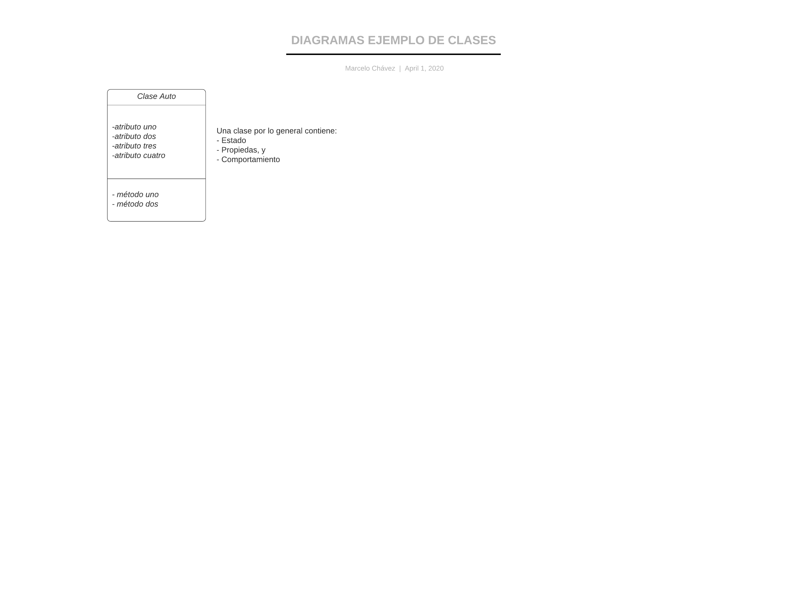

## Programación Orientada a Objetos:

Para entender este paradigma primero tenemos que comprender qué es una clase y qué es un objeto. Un objeto es una entidad que agrupa un
estado y una funcionalidad relacionadas. El estado del objeto se define a través de variables llamadas atributos, mientras que la funcionalidad
se modela a través de funciones a las que se les conoce con el nombre de métodos del objeto.



__*Es importante entender que la instanciación de un objeto, es heredar sus atributos y métodos a partir de la clase ya creada*__

``` python hl_lines="3 8"
import misModulos as modulos
class Auto():
    largoChasis=250
    anchoChasis=120
    ruedas=4
    enmarcha=False

    def arrancar(self,arrancamos):
        self.enmarcha=arrancamos
        if (self.enmarcha):
            return "El auto está en marcha"
        else:
            return "El auto está parado"

    def estado(self):
        print("El auto tiene ", self.ruedas, " ruedas. Un ancho de ", self.anchoChasis, " y un lardo de ", self.largoChasis)
        if(self.enmarcha):
            return "El Auto está en marcha"
        else:
            return "El Auto está parado"
