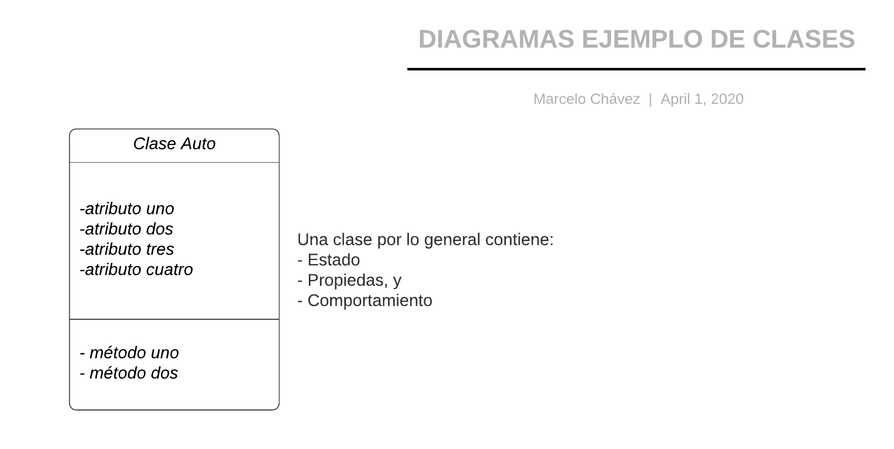

## Programación Orientada a Objetos:

Para entender este paradigma primero tenemos que comprender qué es una clase y qué es un objeto. Un objeto es una entidad que agrupa un
estado y una funcionalidad relacionadas. El estado del objeto se define a través de variables llamadas atributos, mientras que la funcionalidad
se modela a través de funciones a las que se les conoce con el nombre de métodos del objeto.



__*Es importante entender que la instanciación de un objeto, es heredar sus atributos y métodos a partir de la clase ya creada*__

#### A continuación un ejemplo de una clase coche
``` python hl_lines="3 8"
class Mobile():

    def __init__(self,dimension,chip,mark,number):
        self.dimension = dimension
        self.chip= chip
        self.mark = mark
        self.number = number
        self.state_on = True
        print('Your phone have dimension: ',self.dimension)
        print('Your phone con chip: ',self.chip)
        print('Your phone is mark: ',self.mark)
        print('Your phone is number: ',self.number)
        
    def turn_on(self,state_on):
        if self.state_on:
            return "mobile phone {} is turned on".format(self.number)
        else:
            pass

    def turn_off(self,state_off):
        self.state_off=True
        if self.state_off:
            return 'mobile phone is turned off'
        else:
            pass

    def call(self,number_call):
        self.number_call = int(input("Enter the number you want to call: "))
        print('Calling number: ',self.number_call)

print('Mobile Phone 1')
Phone_1 = Mobile('25*12','xbz1','Iphone',983332687)
print('Mobile Phone 2')
Phone_2 = Mobile('25*30','kmer3','Samsung',36525589)

Phone_1.turn_on(True)
Phone_2.turn_on(True)
Phone_1.call(123)
Phone_1.turn_off(False)
